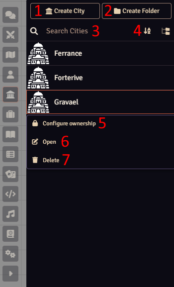
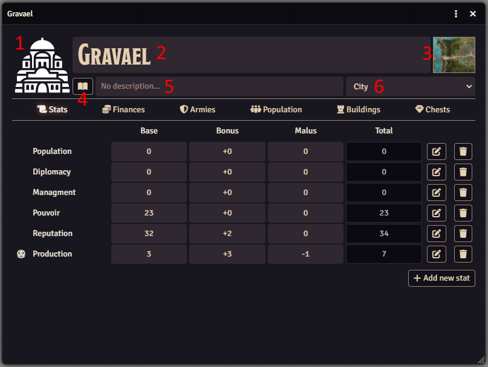
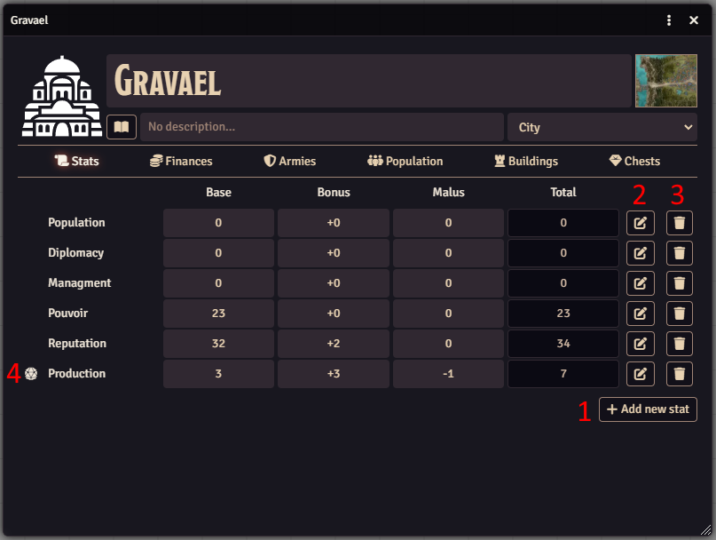
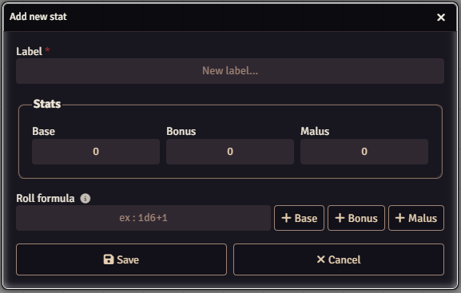
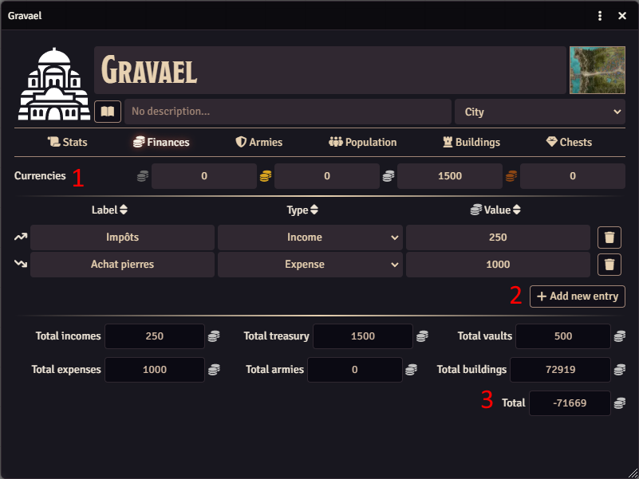
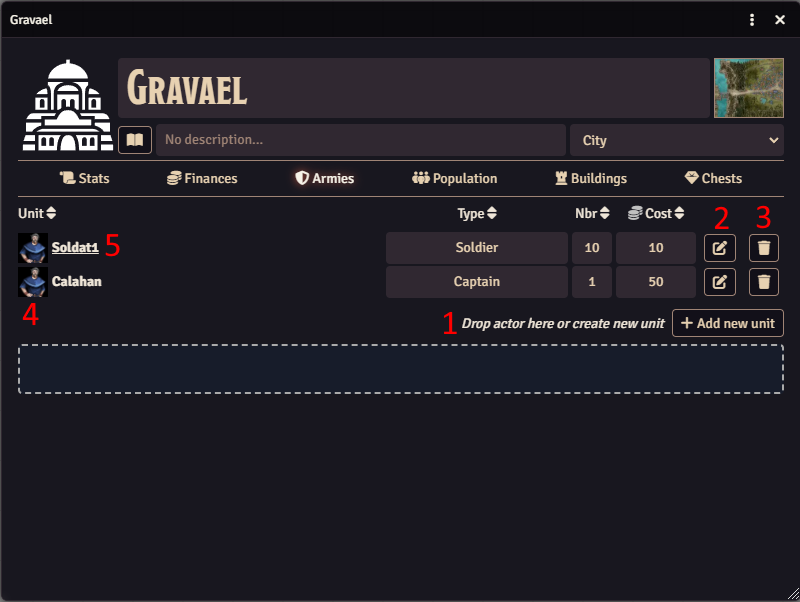
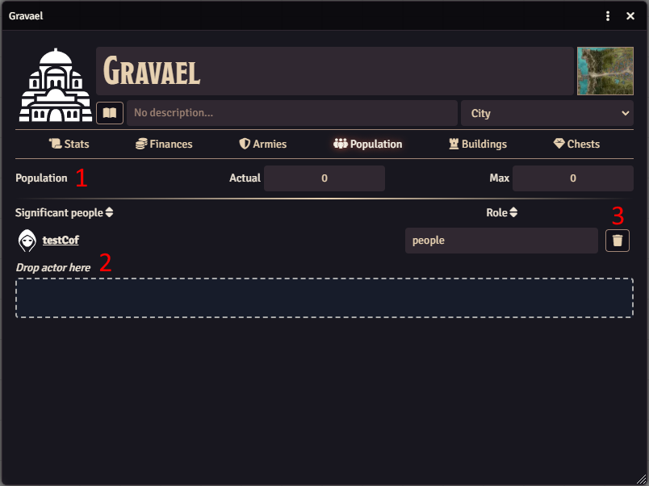
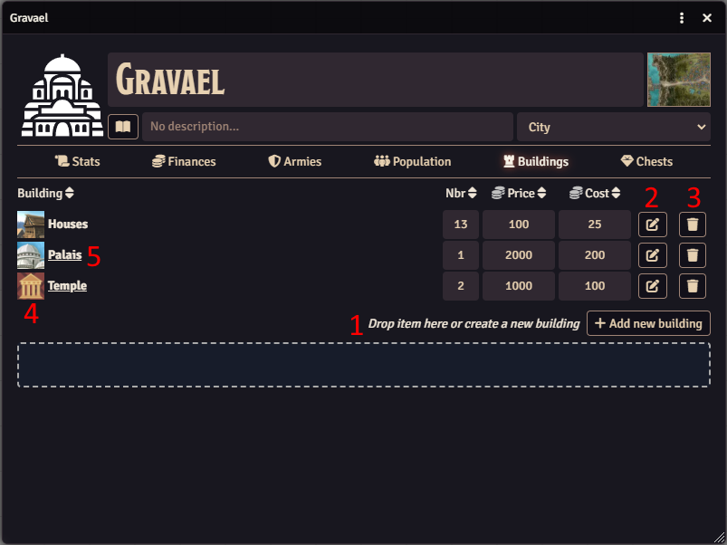
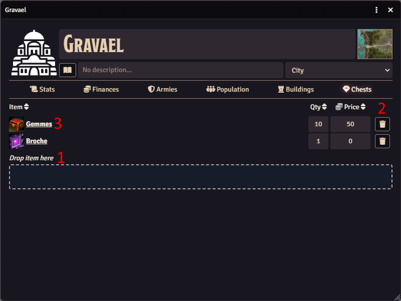

<h1 style="text-align: center;">Cities Managment</h1>
<p style="text-align: center;"> </p>

Allow to manage cities and domains with a sidebar tab and custom city view.

## FoundryVTT
Page : https://foundryvtt.com/packages/cities-managment

## Installation Instructions

To install Cities-Managment, find Cities-Managment in the module browser, or paste the following URL into the Install Module dialog in
the Setup menu of Foundry Virtual Tabletop:

```
https://github.com/ThorkhArokh/cities-managment/releases/latest/download/module.json
```

## Features
 1. [Manage cities with new tab](#manage-cities-with-new-tab)
 2. [Manage city's informations](#manage-citys-informations)
 3. [Manage city's stats](#manage-city-stats)
 4. [Manage city's finances](#manage-citys-finances)
 5. [Manage city's armies](#manage-citys-armies)
 6. [Manage city's population](#manage-citys-population)
 7. [Manage city's buildings](#manage-citys-buildings)
 8. [Manage city's chests](#manage-citys-chests)

### Manage cities with new tab
This module add a new tab "Cities" to the sidebar.

With this new view you can (cf. [Fig. Cities tab](doc/assets/cities_tab.png)) : 
 1. Create new cities
 2. Create folders
 3. Search city by name
 4. Sort cities
 5. Configure ownership on cities
 6. Open city's informations panel
 7. Delete cities

 <figure>
  
  <figcaption>Fig. Cities tab</figcaption>
</figure>

### Manage city's informations
The panel header let you manage main informations of your city.

Here you can (cf. [Fig. City's informations panel](doc/assets/city_panel_header.png)) : 
 1. Set the image
 2. Set the name
 3. Set a link to a map
 4. Access to a journal entry
 5. Set a short description 
 6. Set the size of the city

<figure>
  
  <figcaption>Fig. City's informations panel</figcaption>
</figure>

### Manage city stats
You can add, edit, delete city's stats to feet with your needs.

Features (cf. [Fig. City's stats panel](doc/assets/city_panel_stats.png)) : 
1. Add a new stat (cf. [Fig. Add / update stat dialog](doc/assets/add_stat_dialog.png))
2. Edit a stat (cf. [Fig. Add / update stat dialog](doc/assets/add_stat_dialog.png))
3. Delete a stat
4. Roll dice if a formula is set for the stat 

<figure>
  
  <figcaption>Fig. City's stats panel</figcaption>
</figure>

<figure>
  
  <figcaption>Fig. Add / update stat dialog</figcaption>
</figure>

### Manage city's finances
With this panel you can manage and have an overview of all city's finances.

Features (cf. [Fig. City's finances panel](doc/assets/city_panel_finances.png)): 
1. Currencies : represents city's current money
2. Entries : represents city's financial movements
3. Overview of all costs and revenues for the different sectors of the city  

<figure>
  
  <figcaption>Fig. City's finances panel</figcaption>
</figure>

### Manage city's armies
With this panel you can manage city's armies.

Features (cf. [Fig. City's armies panel](doc/assets/city_panel_armies.png)): 
1. Add (by drag and drop foundry actor) or create units who make up the army (image, type, nbr, cost)
2. Edit units (only module fields. The module doesn't edit linked actor)
3. Delete units (only module's object. The module doesn't delete linked actor)
4. Update unit's image
5. If unit is linked to an actor, show his/her sheet

> Note : Nbr and cost are used by Finances panel

<figure>
  
  <figcaption>Fig. City's armies panel</figcaption>
</figure>

### Manage city's population
With this panel you can manage city's population.

Features (cf. [Fig. City's population panel](doc/assets/city_panel_population.png)):
1. Set actual et maximum population of the city
2. Add (by drag and drop foundry actor) habitant and define his/her role
3. Delete habitant (only module's object. The module doesn't delete linked actor)

<figure>
  
  <figcaption>Fig. City's population panel</figcaption>
</figure>

### Manage city's buildings
With this panel you can manage city's buildings.

Features (cf. [Fig. City's buildings panel](doc/assets/city_panel_buildings.png)): 
1. Add (by drag and drop foundry item) or create buildings (nbr, cost, price)
2. Edit buildings (only module fields. The module doesn't edit linked item)
3. Delete buildings (only module's object. The module doesn't delete linked item)
4. Update building's image
5. If building is linked to an item, show his sheet

> Note : Price, nbr and cost are used by Finances panel

<figure>
  
  <figcaption>Fig. City's buildings panel</figcaption>
</figure>

### Manage city's chests
With this panel you can add items to city's chests.

Features (cf. [Fig. City's chests panel](doc/assets/city_panel_chests.png)): 
1. Add (by drag and drop foundry item) item (qty, price)
2. Delete item (only module's object. The module doesn't delete linked item)
3. Show item sheet

> Note : Qty and price are used by Finances panel

<figure>
  
  <figcaption>Fig. City's chests panel</figcaption>
</figure>

## Change log
Manage project : https://github.com/users/ThorkhArokh/projects/1

### [v1.0.0](https://github.com/ThorkhArokh/cities-managment/releases/tag/v1.0.0)
 - update doc
 - update armies unit
 - update buildings
 - Add sort on tables columns headers
 - Add journal sheet rendering
 - Drop city on scenes (journal mode)
 - Can add bonus, malus, base to stat roll
 - Edit stats
 - Generics Stats
 - Add folders in cities tab; /!\ drag and drop cities in folders
 - show city or not to players (ownership)